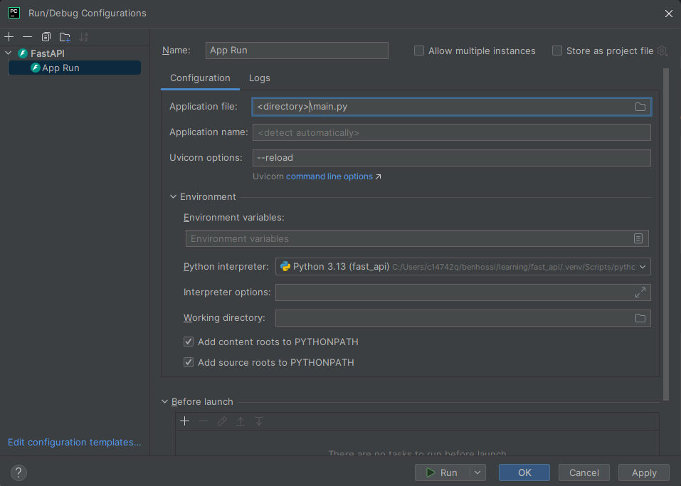

#FAST API LEARNING

Course: Fast API Foundations by Reindert-Jan Ekker on Pluralsight

## Instalation

- pip
  - Run in ternimal: `python -m pip install "fastapi[all]`
- uv
  - Run in terminal: `uv tool install "fastapi[all]"`
- pyproject
  - Add a pyproject file to your project with "fastapi[all]" to the dependencies section
  ```python
    [project]
    name = "fast-api"
    version = "0.1.0"
    description = "Add your description here"
    readme = "README.md"
    requires-python = ">=3.13"
    dependencies = [
        "fastapi[all]",
    ]
    ```
  - Run in ternimal: `uv sync`

## Base Structure

```python
from fastapi import FastAPI

app = FastAPI()


@app.get("/")
async def hello_world():
    return {"message": "Hello world!"}

```

## Running FastAPI

- Run in terminal: `fastapi dev <file_name>.py`
  - Running with `dev` flag make it auto-reload when change something.
- Run in pycharm: 
  

## Documentation

The API documentation is auto-generated by FastAPI in two formats:

### Swagger

Access [127.0.0.1:8000/docs](127.0.0.1:8000/docs) to access your API Swagger style documentation.

### Redocly

Access [http://127.0.0.1:8000/redoc](http://127.0.0.1:8000/redoc) to access your API Redocly style documentation.

**OBS**: both documentation allows you to see an openapi.json specification.

## Query parameters

To pass query parameters you just need to add the parameters into the function definition. The parameter should be
named the same way that is in the query.

E.g.

```python
@app.get("/")
def test(id: int) -> dict:
  return {
    'message': 'success!',
    'id': id
  }
```

Request:

- `GET http://localhost:8000/?id=99`

### Optional parameters

As FastAPI really uses typehint internally, for optional parameters is recomended that you not just set "= None", but
also set the type "None" as typehint too in order to show that the parameter is optional.

E.g.

```python
@app.get("/")
def test(id: int | None = None) -> dict:
  if id:
    return {
      'message': 'success!',
      'id': id
    }
  return {'message': 'success!'}
```

Request with `id` param:

- `GET http://localhost:8000/?id=99`

Request without `id` param:

- `GET http://localhost:8000/`

Both should work 😉

## Path Parameters

E.g.

```python
@app.get("/api/client/{id}")
def test(id: int) -> dict:
  if get_client(id):
    return {'message': 'success!'}
  else:
    raise HTTPException(status_code=404, detail=f"No client found for id {id}.")
```

Request with `id` path param :

- `GET http://localhost:8000/api/client/2`

- **OBS 1**: remember that, if you don't use typehints in function parametrers, it will be passed as string (str) 😉.
- **OBS 2**: sometimes with path parameters, we might return only one result. In case we don't find data, we should
  return the correct HTTP Statsu code (404 in this case).

## Data Validation

Unlike python, that ignores typehints, FastAPI really uses it, to validate and convert the query parameters. As the
query params is always passed as str to application, it's very important to use typehints in our function parameters. So
the FastAPI converts and validate the parameters for us 😉.

## POST Requests

Every PUT operation should have a payload body with the data to be pesisted. This body is passed as a function
parameter. Using pydantic, the payload should have all mandatory atributes.

E.g.

```python
@app.post("/api/client", status_code=201)
def test(client: Client) -> Client:
  new_client = Client(first_name=client.first_name, last_name=client.last_name, age=client.age)
  new_client.id = persist_client(new_client).id
  return new_client
```

Request

POST http://localhost:8000/api/cars

```json
{
  "first_name": "Testonildo",
  "last_name": "from Silva",
  "age": 40
}
```

**OBS**: note that the attribute id is optional, so we're not obligated to inform it in the request body.

## PUT Requests

Every PUT operation should have a payload body with the data to be pesisted. This body is passed as a function
parameter. Using pydantic, the payload should have all mandatory atributes.

E.g.

```python
@app.put("/api/client/{id}", status_code=201)
def test(id: int, new_client: Client) -> Client:
  client: Client = find_client_by_id(id)
  if client:
    client.first_name = new_client.first_name
    client.last_name = new_client.last_name
    client.age = new_client.age

    update_cliente(client)

    return client
  else:
    raise HTTPException(status_code=404, detail=f"There is no client with id {id}.")
```

## DELETE Requests

DELETE operations should **NOT** have a payload body. However, it needs to have some identification to retrieve the data
to be deleted.

E.g.

```python
@app.delete("/api/client/{id}", status_code=204)
def test(id: int) -> None:
  client: Client = find_client_by_id(id)
  if client:
    remove_client_from_bd(client)
  else:
    raise HTTPException(status_code=404, detail=f"There is no client with id {id}.")
```
