from phonebook import Phonebook

# Unit Tests With PYTEST

Course: Testing in Python 3 by Emily Bache on Pluralsight

## Installation
- pip
  - Run in terminal: `python -m pip install pytest`
- uv
  - Run in terminal : `uv add pytest --dev`
    - it will add `pytest` as a developmente dependency to your `pyproject.toml`.

## Test Vocabulary

- Test Suite
  - It's all the tests you have implemented and could run to assure everything is ok.
- Test case
  - It's a single teste you write to validade a cenário.
- Fixture
  - Code to manage resourses that you'll need during your tests
- Runner
  - The result report of your tests.
- Units Under Test
  - the class/method/ function that you
- Assertions
  - Assertions are the validations that are executed in the middle or end of the test cases to evaluate that the actual result is as expected.
  - There are 3 types of assert:
      - 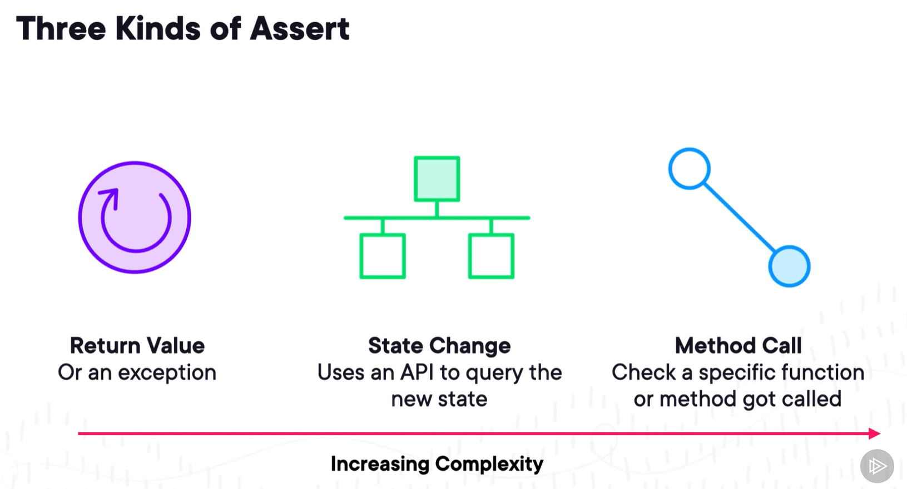

## Pytest Structure

Create a python package named `tests` on your project and mark it as `Test Source Root` on Pycharm.

Inside it, create a file starting with `test_` or finishing with `_test.py`, and add your tests inside it.
E.G:

```python
import pytest

from module03 import Phonebook


def test_lookup_by_name(phonebook):
  phonebook = Phonebook()
  phonebook.add("Bob", "12345")
  number = phonebook.lookup("Bob")
  assert number == "12345"
```

### Testing Exceptions

In order to test a method that throws an exception, you should create a context manager to capture the exception. 
It is done with the `pytest.riases(Exception)`.

```python
import pytest

from module03 import Phonebook


def test_missing_name(phonebook):
  phonebook.add("Bob", "12345")
  with pytest.raises(KeyError):
    phonebook.lookup("Mary")


```

### Pytest Fixture

Pytest use the decorator `@pytest.fixture` to create its fixtures (setup and teardowm). By convention, the def name of the fixture is the resource you're returning/instantiate. 
and you should pass it as a parameter on your teste cases.

#### Setup Fixture

The decorator `@pytest.fixture` is runned first, creating the object that will be used for the test case `test_find_character`.

```python
import pytest

from src.module03.phonenumbers import Phonebook


@pytest.fixture
def phonebook():
  '''Provides an empty phonebook.'''
  phonebook = Phonebook()
  return phonebook


def test_lookup_by_name(phonebook):
  phonebook.add("Bob", "12345")
  number = phonebook.lookup("Bob")
  assert number == "12345"

```

#### Setup and Teardown Fixture

It uses the same structure, but instead of returning the object with a `return`, use `yield` to wait until the resource is released.
In the exemple bellow, the class Phonebook receive a file as an argument on `__init__` that should be destroyed after the test case finishes.

```python
import pytest

from src.module03.phonenumbers import Phonebook


@pytest.fixture
def phonebook(tmpdir):
  '''Provides an empty phonebook.'''
  phonebook = Phonebook(tmpdir)
  yield phonebook
  phonebook.clear_cache()


def test_missing_name(phonebook):
  phonebook.add("Bob", "12345")
  with pytest.raises(KeyError):
    phonebook.lookup("Mary")
```

**OBS**: the `tmpdir` passed as a parameter to Phonebook, is a builtin fixture of pytest that provides a temporary and unique directory to each test case.

To see all the fixture of a test suite, run one of the commands bellow on the terminal. If your test fixture has a docstring. it will be shown here.
```pytest --fixtures```
```python -m pytest --fixtures```


**OBS**: to show all the fixtures you have in your test cases, you should th PYTHONPATH on your terminal
```shell
PYTHONPATH='<your_source_code_dir>'
```
```shell
$env:PYTHONPATH='supermarket_receipt'
```

### Parametrized Test

We can use parametrized tests when we need to test method with diferents inputs. So, intead of write different tests or 
make a lot of asserts inside a single test case, we can just make a lot of diferent entries to a single test case.

```python
import pytest

from src.module03.phonenumbers import Phonebook


@pytest.fixture
def phonebook(tmpdir):
  '''Provides an empty phonebook.'''
  phonebook = Phonebook(tmpdir)
  yield phonebook
  phonebook.clear_cache()


@pytest.mark.parametrize(
  "entry1, entry2, is_consistent", [
    (("Bob", "12345"), ("Anna", "012345"), True),
    (("Bob", "12345"), ("Anna", "12345"), False),
    (("Bob", "12345"), ("Anna", "123"), False),
  ]
)
def test_is_consistent(phonebook, entry1, entry2, is_consistent):
  phonebook.add(*entry1)
  phonebook.add(*entry2)
  assert phonebook.is_consistent() == is_consistent
```

Paramitrized testing helps to reduce duplication in the code and it's recommended when the test case (the 'act' step) 
is the same in the others test cases and we just need to vary the data we use to test.

### Organizing Your Test Code

When we deal with large projects, is common to use some special features:

#### conftest.py

It is a special modile/file that pytest recognizes, and it's the recommended module to store all your fixtrues.
All test cases inside the test module will look for fixtures inside the `confitest.py`.

#### Pytest Marks

Pytest Marks allows you to add metadata or labels to your test cases, making it easier to organize and customise your test cases.

To see all pytest markers, hjust type `python -m pytest --markers` in the terminal.

##### The `pytest.ini`

A file to store all the personal configuration to your pytest

```text
[pytest]
addopts = --strict-markers
markers = slow: Run tests that use sample data from file (deslect with '-m "not slow"')
```

The `addopts = --strict-markers` avoid users to use markers that is not listed on the markers parameter in the ini file.

##### @pytest.mark.slow

It's a pytest decorator to sinalize that the test case may be slow and can be skipped if you want.
We can use a `pytest.ini` file to configure how to run it or not.

E.G: 
This test loads a csv file that can have tons of data, and take too much time to run.

```python
import csv
import pytest
from src.module03.phonenumbers import Phonebook


@pytest.fixture
def phonebook(tmpdir):
  '''Provides an empty phonebook.'''
  phonebook = Phonebook(tmpdir)
  yield phonebook
  phonebook.clear_cache()


@pytest.mark.slow
def test_large_file(phonebook):
  with open("sample_data/sample1.csv") as f:
    csv_reader = csv.DictReader(f)
    for row in csv_reader:
      name = row["Name"]
      number = row["Number"]
      phonebook.add(name, number)
  assert phonebook.is_consistent()

```

Now, this test can be "skipped" when you run all the test suite, just typying `python -m pytest -m "not slow"` in the terminal.
That will deselect the test cases marked with `@pytest.mark.slow` decorator, and it will not run.

This is very helpful in test cases that tak too long to run in development environment. Just run the fast ones or run all just when you need.

##### @pytest.mark.skip

It is usefull when your test case is not ready yet, or the feature it tests is not already finished, and you don't want 
run it.

```python
import pytest

@pytest.mark.skip("Not already implemented.")
def test_new_feature():
  assert True
```

Unlike the `@pytest.mark.slow`, the `@pytest.mark.skip` can not be run. Once it's marked as a skipp test case, it will 
only run when you remove the decorator.

##### @pytest.mark.skipif

Similar to the `@pytest.mark.skip` but with a conditional.

```python
import pytest
import sys
from src.module03.phonenumbers import Phonebook


@pytest.mark.skipif(sys.version_info < (3, 6), reason="requires python 3.6 or higher to run")
def test_phonebook_contain_names():
  phonebook = Phonebook()
  assert 'Bob' in phonebook.names()
```

If you're running python 3.6, this test will be skipped.

## Test Doubles

A Test Double is recommended when you want to test a code unit that has a dependency, like an object or an external tool.

So you can replace that code for a Test Doble that does and return what you need without more complexity.

It may look not productive to "re-write" a code, but, sometimes, the class/object you need is too complex to instantiate
or your code use an external API that may be caught off-line during your test. You can't take this risk, so you should 
use a Test Double to ensure that your test case has all data and tools it need inside it. In the most cases you just 
need what the API or an object returns. That's why Test Doubles are made for.


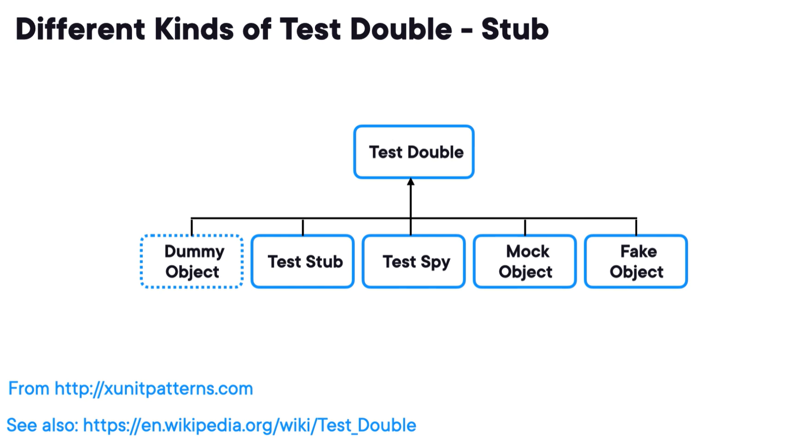

### Stubs

Stubs allows you to set a hard coded response (or return) for a method of an object.

For exemple:
```python
from src.module05.stub.alarm import Alarm


class StubSensor:
    def sample_pressure(self):
        return 17.0


def test_alarm_is_on_at_lower_threshold():
    alarm = Alarm(StubSensor())
    alarm.check()
    assert alarm.is_alarm_on
```

In the exemple above, we created a stub of the calss Sensor (StubSensor) that Alarm needs to be constructed. For our test, doesn't 
matter what the `sample_pressure` method does, as we get a value 17.0 from it. So we hard coded te value we need as the 
return of the method `sample_pressure`.

Another exemple using Mock:
```python
from unittest.mock import Mock

from src.module05.stub.alarm import Alarm
from src.module05.stub.sensor import Sensor


def test_alarm_is_on_at_lower_threshold():
    stub = Mock(Sensor)
    stub.sample_pressure.return_value = 17.0
    alarm = Alarm(stub)
    alarm.check()
    assert alarm.is_alarm_on

```
Now we're using the python built-in `Mock` to build the stub. It does the same as the previous exemple, but more 
concisely. When you use Mock a pass the real class you want stub, Mock has access to all methods of the real class and 
can replace what is returned as we see in the code `stub.sample_pressure.return_value = 17.0`.

### Fakes

Fake is like a stub but has an implementation with logic, behavior, but is not good for production.
They're a good option when you're dealing with a files. That can be slow, so you can fake the file in memory to run 
your tests.


E.g.:
```python
import io

from src.module05.fake.html_pages import HtmlPagesConverter


def test_convert_second_page():
    fake_file = io.StringIO("""\
page one
PAGE_BREAK
page two
PAGE_BREAK
page three
PAGE_BREAK
    """)
    converter = HtmlPagesConverter(fake_file)
    converted_text = converter.get_html_page(1)
    assert converted_text == "page two<br />"
```
In the exemple above, the library `io.StringIO` is replacing the real file. It has the same methods a file has but it
runs entirely on memory, which eliminates the external dependencies.

### Dummy Objects
Provides an alternative actor in place of a real object (sometimes None) in order to test our cenario.

E.g.:

````python
import pytest


def fizzbuzz(n, additional_rules):
    answer = str()
    rules = {3: "Fizz", 5:"Buzz"}
    additional_rule = {7: "Whizz"}
    if additional_rules:
        rules.update(additional_rule)

    for divisor in sorted(rules.keys()):
        if n % divisor == 0:
            answer += rules[divisor]

    if not answer:
        answer = str(n)

    return answer


@pytest.mark.parametrize(
    "number, expected", [
        (2, "2"),
        (3, "Fizz"),
        (5, "Buzz"),
        (15, "FizzBuzz"),
    ]
)
def test_fizzbuzz_nomal_number(number, expected):
    assert fizzbuzz(number) == expected


@pytest.mark.parametrize(
    "number, additional_rules, expected", [
        (7, {7: "Whizz"}, "Whizz"),
    ]
)
def test_fizzbuzz_nomal_number(number, additional_rules, expected):
    assert fizzbuzz(number, additional_rules) == expected

````
In this teste case, the `test_fizzbuzz_nomal_number` will pass, but the `test_fizzbuzz_nomal_number` will break because 
it doesn't passes the new argument `additional_rules` to the function `fizzbuzz`. 

So, as this test case doesn't test the additional rules at all, we can just pass `None` as an argument.

```python
@pytest.mark.parametrize(
    "number, expected", [
        (2, "2"),
        (3, "Fizz"),
        (5, "Buzz"),
        (15, "FizzBuzz"),
    ]
)
def test_fizzbuzz_nomal_number(number, expected):
    assert fizzbuzz(number, None) == expected
```

Using a dummy on your tests usually can be a design smell on your code. In this case, the argument `additional_rules` 
should be an optional paameter in the function.

E.g.:
```python
import pytest


def fizzbuzz(n, additional_rules=None):
    answer = str()
    rules = {3: "Fizz", 5:"Buzz"}
    additional_rule = {7: "Whizz"}
    if additional_rules:
        rules.update(additional_rule)

    for divisor in sorted(rules.keys()):
        if n % divisor == 0:
            answer += rules[divisor]

    if not answer:
        answer = str(n)

    return answer


@pytest.mark.parametrize(
    "number, expected", [
        (2, "2"),
        (3, "Fizz"),
        (5, "Buzz"),
        (15, "FizzBuzz"),
    ]
)
def test_fizzbuzz_nomal_number(number, expected):
    assert fizzbuzz(number) == expected


@pytest.mark.parametrize(
    "number, additional_rules, expected", [
        (7, {7: "Whizz"}, "Whizz"),
    ]
)
def test_fizzbuzz_nomal_number(number, additional_rules, expected):
    assert fizzbuzz(number, additional_rules) == expected
```
In the exemple above, we no longer need the dummy because we fiz our design smell just defining a default value to the 
`additional_rules`.

You can use a dummy when you're forced to pass a collaborator to a class or method that is not used in the scenario 
you're testing.

### Spy

A Spy records the method calls it receives, so we can assert they are correct.

E.g.:
```python
from unittest.mock import Mock, call

from src.module05.spy.discounts import DiscountManager
from src.module05.spy.model_objects import Product, User, DiscountData

def test_for_for_users_with_mock_framework():
    notifier = Mock()
    discount_manager = DiscountManager(notifier)
    product = Product("headphones")
    product.discounts = list()
    discount_details = DiscountData("10% off")
    users = [User("user1", [product]), User("user2", [product])]

    discount_manager.create_discount(product, discount_details, users)

    assert product.discounts == [discount_details]
    expected_calls = [
        call(users[0], f"You may be interested in a discount on this product! {product.name}"),
        call(users[1], f"You may be interested in a discount on this product! {product.name}"),
    ]
    notifier.notify.assert_has_calls(expected_calls)
```

The exemple above uses the Mock framework from python Unittest to build a spy. This object has a method named 
`assert_has_calls` that receive a call object in rder to check if they are called.

In this case, the Notifier object has a `notify` method that receives the user and the message, so we create a list of 
those call (in the `expected_calls` list) to use it in the `assert_has_calls`.

### Mock

A Mock knows what method calls to expect, and fails the test if they ar not correct.
It works like a spy but Mocks is told in advance about what method will be called.

E.g.:
```python
from src.module05.spy.discounts import DiscountManager
from src.module05.spy.model_objects import Product, DiscountData, User


class MockNotifier:
    def __init__(self):
        self.expected_user_notification = list()

    def notify(self, user, message):
        # Don't send any messages from the unit test, check all notifications are expected
        expected_user = self.expected_user_notification.pop(0)
        if user != expected_user:
            raise RuntimeError(f"Got notification message for unexpected user {user.name}. Was expecting notification "
                               f"for user {expected_user.name}")

    def expect_notification_to(self, user):
        self.expected_user_notification.append(user)


def test_discount_for_users():
    notifier = MockNotifier()
    discount_manager = DiscountManager(notifier)
    product = Product("headphones")
    product.discounts = list()
    discount_details = DiscountData("10% off")
    users = [User("user1", [product]), User("user2", [product])]
    notifier.expect_notification_to(users[0])
    notifier.expect_notification_to(users[1])

    discount_manager.create_discount(product, discount_details, users)

    assert product.discounts == [discount_details]
```

In the exemple above, the `notifier` has the method `expect_notification_to` that receives the users will be notified.

When the `create_discount` is called, it will call the `notifier.notify` that validates if the user is the correct one.

Using Mock, you told it in advancce what method will be called with what arguments. If these expectatiosn aren't met, 
it throws away an exception in the act part of the test, not in the assertion.

Using a Spy, raises an error afterm in the assertion part of the test.

### How to use Test Doubles


Sumarizing, test doubles are:

- Dummy
  - Usually `None`
- Stub
  - Responds with fixed, pre-prepared data
- Fake
  - Has an implementation, but unsuitable for production
- Spy
  - Similar to Stub, bit can asssert if the test fails. 
- Mock
  - Similar to Spy but throws away an exception in the act part of the test, not in the assertion.

## Approvals

Is an alternative to `assert`. It allows us to compare 2 strings (but not only strings) through a diff.

When you run it for the first time, it will create 2 files with your data to be compared with: 
- **`your_test_file.your_test_case.received.txt`** is what the output that approval generated from your test case.
- **`your_test_file.your_test_case.approved.txt`** is the already approved output you're waiting to receive from the test case

The approval will compare this two files. If the content are the same, the test will pass.

E.g. changing from assert to approval:

Test case with assert:
```python
import pytest

from src.module06.supermarket_receipt.model_objects import SpecialOfferType


def test_no_discount(teller, cart, toothbrush, apples):
    teller.add_special_offer(SpecialOfferType.TEN_PERCENT_DISCOUNT, toothbrush, 10.0)
    cart.add_item_quantity(apples, 2.5)

    receipt = teller.checks_out_articles_from(cart)

    assert 4.975 == pytest.approx(receipt.total_price(), 0.01)
    assert list() == receipt.discounts
    assert 1 == len(receipt.items)
    receipt_item = receipt.items[0]
    assert apples == receipt_item.product
    assert 1.99 == receipt_item.price
    assert 2.5 * 1.99 == pytest.approx(receipt_item.total_price, 0.01)
    assert 2.5 == receipt_item.quantity
```

Test case with approval:
```python
import approvaltests

from module06.supermarket_receipt.receipt_printer import ReceiptPrinter
from src.module06.supermarket_receipt.model_objects import SpecialOfferType
 
def test_no_discount(teller, cart, toothbrush, apples):
    teller.add_special_offer(SpecialOfferType.TEN_PERCENT_DISCOUNT, toothbrush, 10.0)
    cart.add_item_quantity(apples, 2.5)

    receipt = teller.checks_out_articles_from(cart)

    receipts_as_string = ReceiptPrinter().print_receipt(receipt)
    approvaltests.verify(receipts_as_string)

```
In the exemple above, we get rid of sveral assetions for just one approval. When we pass the `receipt_as_string` to 
`approvaltests.verify`, it will create the `your_test_file.your_test_case.received.txt` to be compared with the 
`your_test_file.your_test_case.approved.txt`.

**OBS**: the `ReceiptPrinter().print_receipt(receipt)` is a class we created just to represent a receipt object as 
string.

In resume, a test case have three parts:
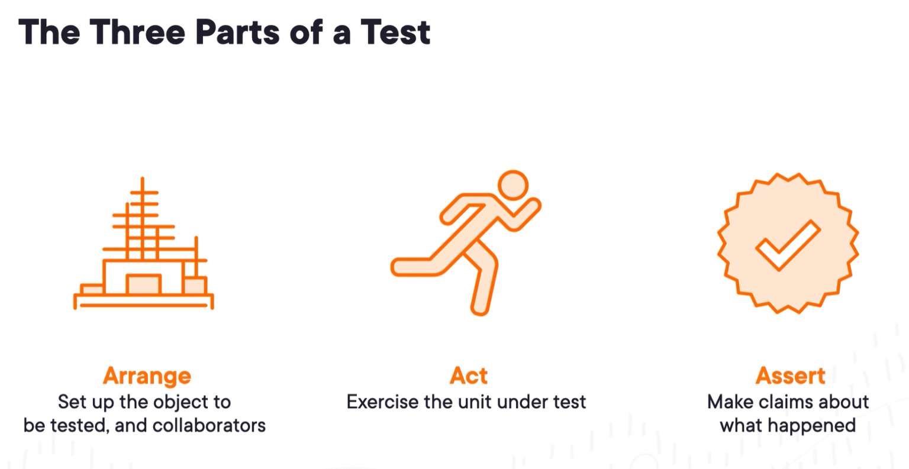

When using approvals, we stil have these three parts, but intead of an assert, we have a diff conpasion:
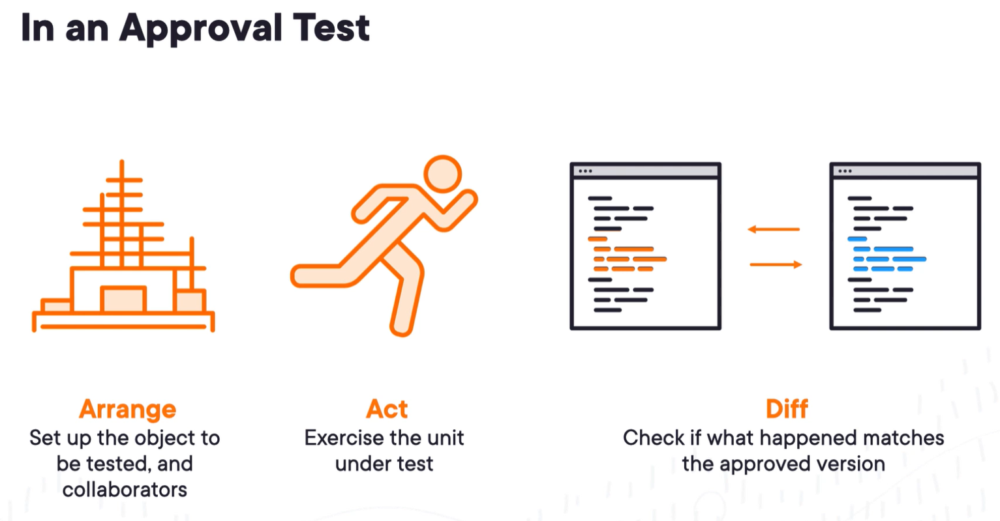

### Setup

#### Reporter

To use approval properly, we need to pass the additiona argument `--approvaltests-use-reporter='PythonNative'` on 
the command line. Otherwise, it will raise a `RuntimeError: This machine has no reporter configuration`.
We can configure it on pycharm as well:
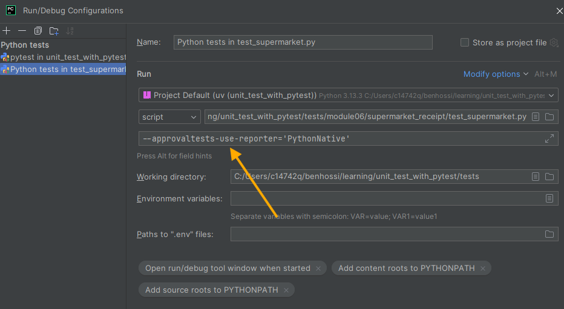

#### Printer Design

It's the most important to a successfull approval testing because is the class responsable to print all data we need to 
compare.

Advices to write a good printer
- Lay out text on multiple lines;
- Exclude irrelevant details, so your test will only fail with a good reason.
- 
If the test fails and you don't understand what's going on, it's a sign that you need to improve your printer 

#### Approvaltests Config

It's a good practice to have your approved_files in a different directory under your test directory (approved_files for 
exemple). So the approvaltests needs to know where these files are, otherwise, it will create/look then in the same 
directory the test case are.

To do this, just create a `approvaltests_config.json` file in the directory and set on it a `subdirectory` option:
```json
{
  "subdirectory": "approved_files"
}
```

### Comparing Received and Approved files

When running the approval for the first time, the test will fail. That's normal because there is no approved file yet. 
So we must open both, `your_test_file.your_test_case.received.txt` and `your_test_file.your_test_case.approved.txt` 
(preferencial in a diff tool), check if the received file contains all the infos you want to validate. If it's ok, just 
apply the changes to the approved file. 

Now, the `your_test_file.your_test_case.approved.txt` will contains the correct strings to be compared with 
`your_test_file.your_test_case.received.txt`. If there is some difference between than, the test will fail.****

### Advantages of using Approvals

- Easier to understand failures, using a diff
- Easier to update approved files with a tool
- Cheaper test maintenance
- Can simplify a test case, changing several assertions in only one approval

### Verify All Aprovals

We can use approvals to check a bunch of different combinations using `approvaltests.very_all_combinations`.

```python
import approvaltests

from module06.gilded_rose.gilded_rose import Item, GildedRose


def print_item(item):
    return f"Item({item.name}, sell_in={item.sell_in}, quality={item.quality})"


def test_update_quality():
    item = Item("foo", 0, 0)
    items = [item]

    giled_rose = GildedRose(items)
    giled_rose .update_quality()

    approvaltests.verify(print_item(item))
```

The test case above tests only one combination for an item. If we have 5 itens, with 3 possibility of quality and sell 
ins, the tests could turn into a mess.

So, we can make s simple test case that can test all this variations.

```python
import approvaltests

from module06.gilded_rose.gilded_rose import Item, GildedRose


def print_item(item):
    return f"Item({item.name}, sell_in={item.sell_in}, quality={item.quality})"


def update_quality_printer(args, result):
    return f"{args} => {print_item(result)}\n"


def test_update_quality():
    names = ["foo", "Aged Brie", "Backstage passes to a TAFKAL80ETC concert", "Sulfuras, Hand of Ragnaros"]
    sell_ins = [0]
    qualities = [0, 1, 2]

    approvaltests.verify_all_combinations(
        update_quality_for_item,
        [names, sell_ins, qualities],
        formatter=update_quality_printer
    )


def update_quality_for_item(foo, sell_in, quality):
    item = Item(foo, sell_in, quality)
    items = [item]
    gilded_rose = GildedRose(items)
    gilded_rose.update_quality()
    return item
```

The test case above will run the method `update_quality_for_item` for eache item of the lists names, sell_ins and 
qualities, combining their values. The approval file it wull generate is like this:
```
('foo', 0, 0) => Item(foo, sell_in=-1, quality=0)
('foo', 0, 1) => Item(foo, sell_in=-1, quality=0)
('foo', 0, 2) => Item(foo, sell_in=-1, quality=0)
('Aged Brie', 0, 0) => Item(Aged Brie, sell_in=-1, quality=2)
('Aged Brie', 0, 1) => Item(Aged Brie, sell_in=-1, quality=3)
('Aged Brie', 0, 2) => Item(Aged Brie, sell_in=-1, quality=4)
('Backstage passes to a TAFKAL80ETC concert', 0, 0) => Item(Backstage passes to a TAFKAL80ETC concert, sell_in=-1, quality=0)
('Backstage passes to a TAFKAL80ETC concert', 0, 1) => Item(Backstage passes to a TAFKAL80ETC concert, sell_in=-1, quality=0)
('Backstage passes to a TAFKAL80ETC concert', 0, 2) => Item(Backstage passes to a TAFKAL80ETC concert, sell_in=-1, quality=0)
('Sulfuras, Hand of Ragnaros', 0, 0) => Item(Sulfuras, Hand of Ragnaros, sell_in=0, quality=0)
('Sulfuras, Hand of Ragnaros', 0, 1) => Item(Sulfuras, Hand of Ragnaros, sell_in=0, quality=1)
('Sulfuras, Hand of Ragnaros', 0, 2) => Item(Sulfuras, Hand of Ragnaros, sell_in=0, quality=2)
```

See that for every name, it runs 1 quality. If we insert a new sell_in value, it will generate us 12 more scenarios.

The `approvaltests.verify_all_combinations` can help us improve our test coverage with very little addition of code. 
However, it can improve the number of test cases and the time to run it.

## Code Coverage

The Coverage Report shows us which lines of our code are executed by out tests. If a line is not being executed, it 
could have bug in that your test is not able to catch.

### Setup

- Install `coverage` using uv or pip.

### Running Coverage

#### Terminal

To run Coverage, just type `PYTHONPATH=../src coverage run -m pytest --approvaltests-use-reporter=PythonNative` in your 
terminal. It will execute the tests, but generates a report to help us find lines of our code that's not being tested 
yet.

To see the report, just type `coverage report -m`:
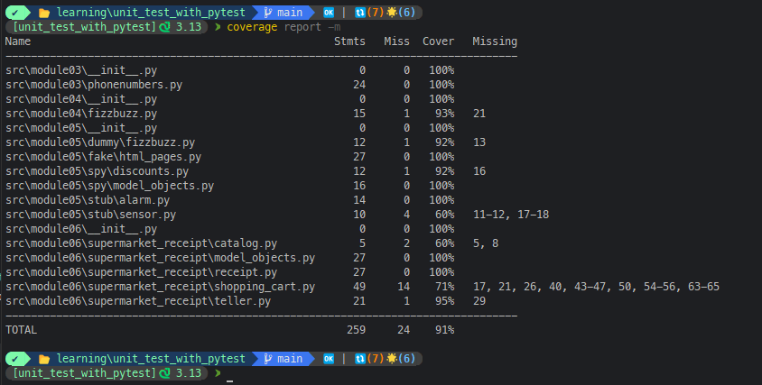

Or you can see a HTML version usig the command `coverage html`:
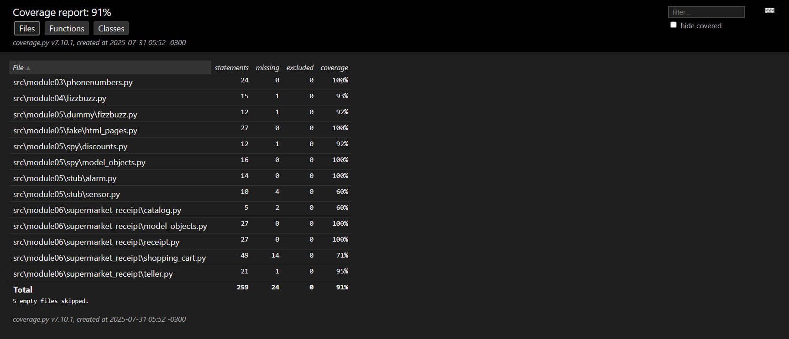

In the HTML report, we can have more detailed information about the code coverage just clicking on the file. The red 
lines shows us pieces of code that are not being tested.
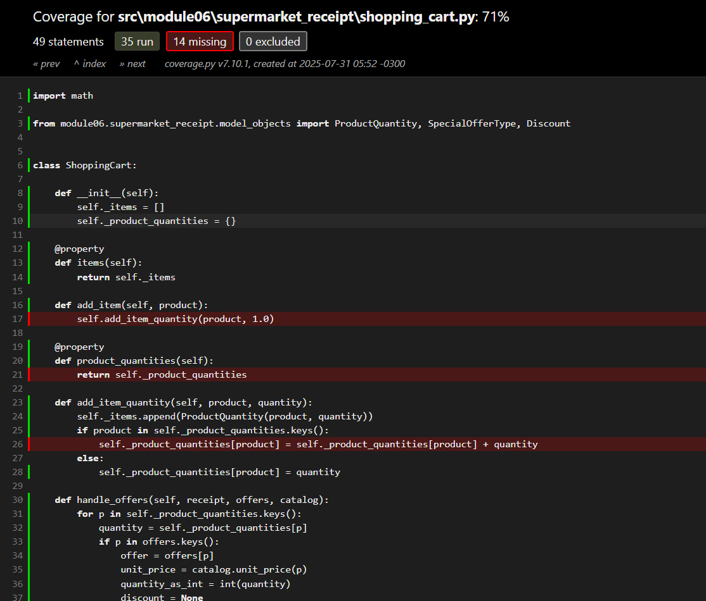
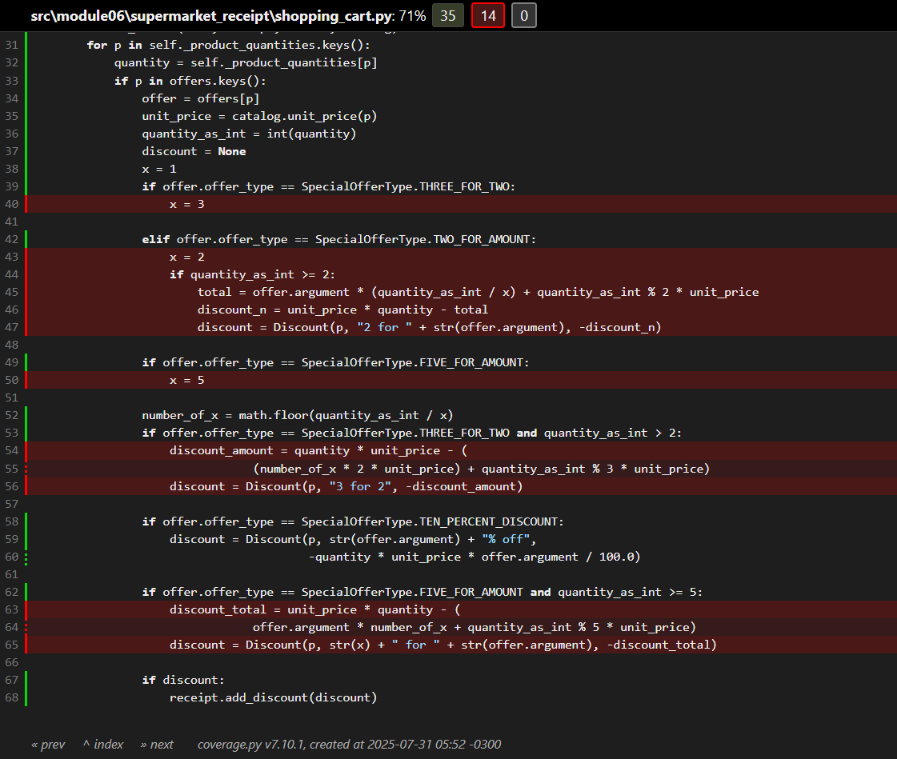


#### Pycharm

Pycharm can also show us the coverge os our tests. We just have to RUN WITH COVERAGE:
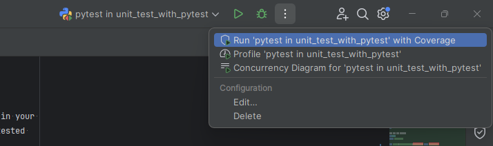

The results will be dispalyed in the Coverage session:
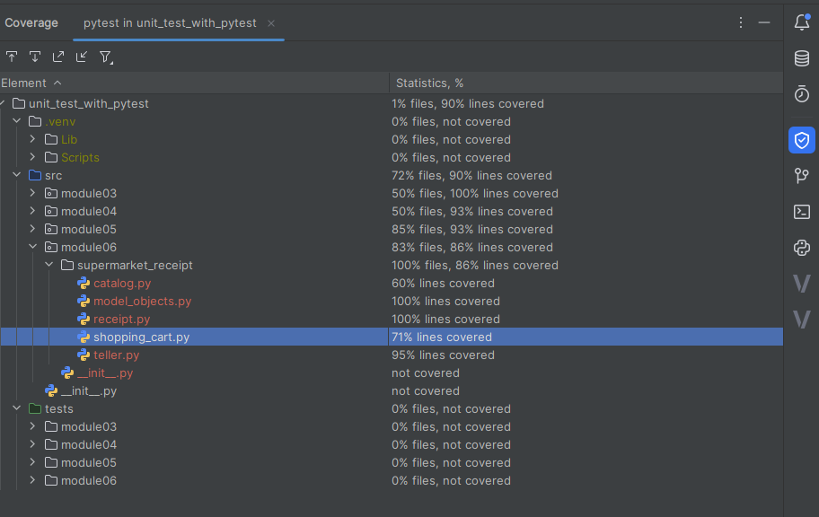

As in the HTML file, clicking on the file will open it. Now we can check, directly in the file, which line is covered 
and which is not, just looking to the gutter:
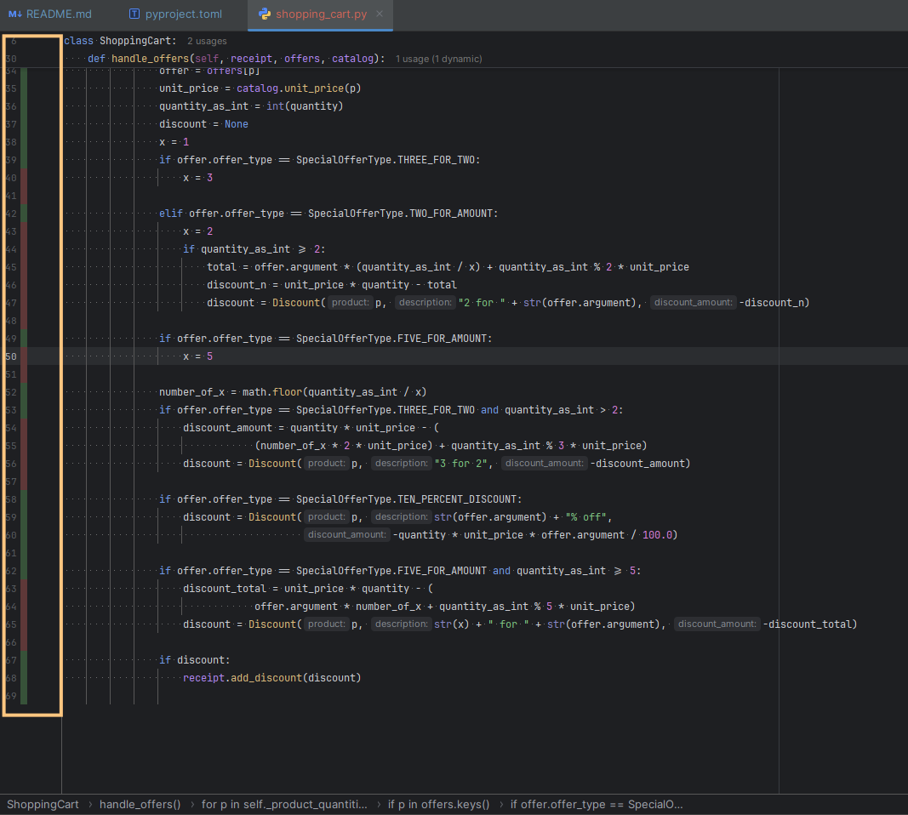

### Spot Missing Tests

Use Branch Coverage and Mutation tests to find pieces od the code that is not properly covered by tests.

#### Branch Coverage

Although we get 100% coverage in our code, there might be some part of then that are not properly or fully tested in 
all combinations. To ensure that we're not missing a spot, we can use branch coverage.

Branch coverage marks the conditionals of the code that is covered but only in one way.

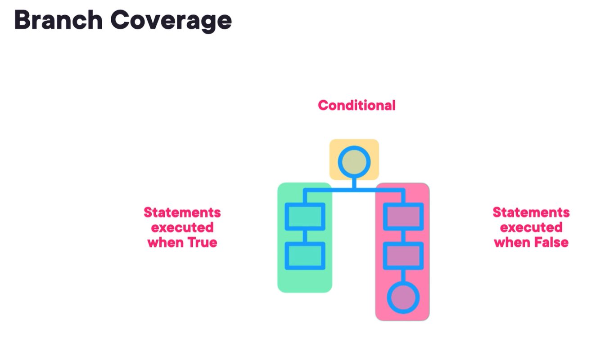

Branch coverage are particulary helpfull when there is no else clause in our conditional. As there is no other 
alternative to be marked as RED (else), we can't see if there is a problem, until we run Branch Coverage.

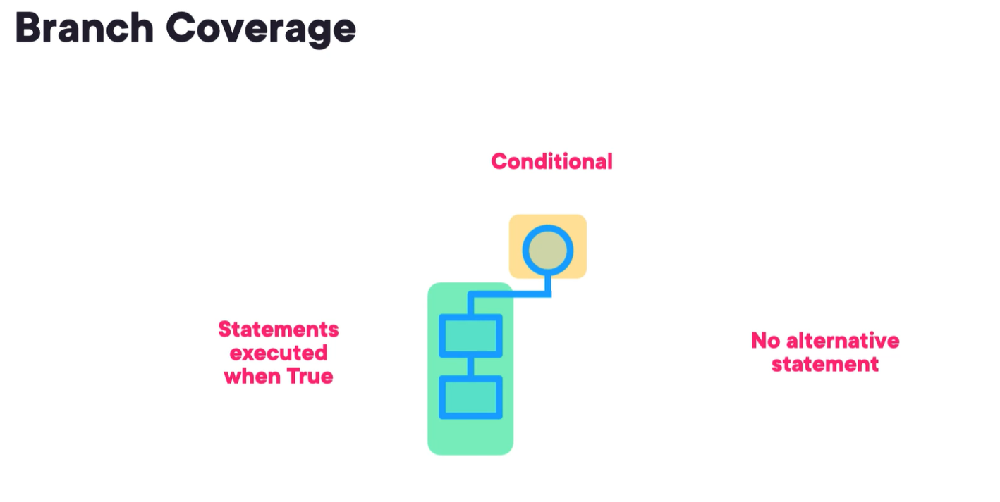

In the command line, we can just type `--branch` to run it. In Pycharm, got to 
Settings -> Build, Execution, Deployment -> Coverage -> Python Coverage and check the option Branch coverage

It can help showing us there are some spots in our code that is not tested yet.

However, branch coverage can increase the execution time of our tests. Using the exemple in this session, to increase 
`GildedRose` coverage, we have to do more combinations which will increase our test cases up to 80 😱.

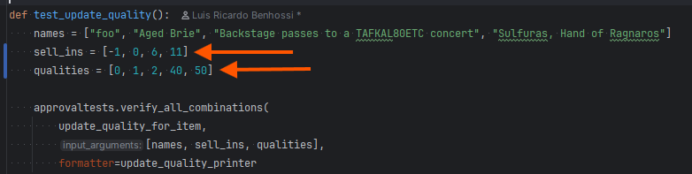

#### Mutation Testing

Sometimes, even when we get 100% of code coverage, it doesn't mean that we have good tests. Mutation tests can show us 
piece of code that doesn't have good tests, introducing some little changes in our code to check if the tests fails. 
like changing a less or equal sign (<=) to just less (<) or changing the sign of a calculation (+ changes to -) for 
exemple.

If our test case fails, that's good... We've killed the mutation. If the test passes, means that the mutant survived, 
and our test case is not good enough.

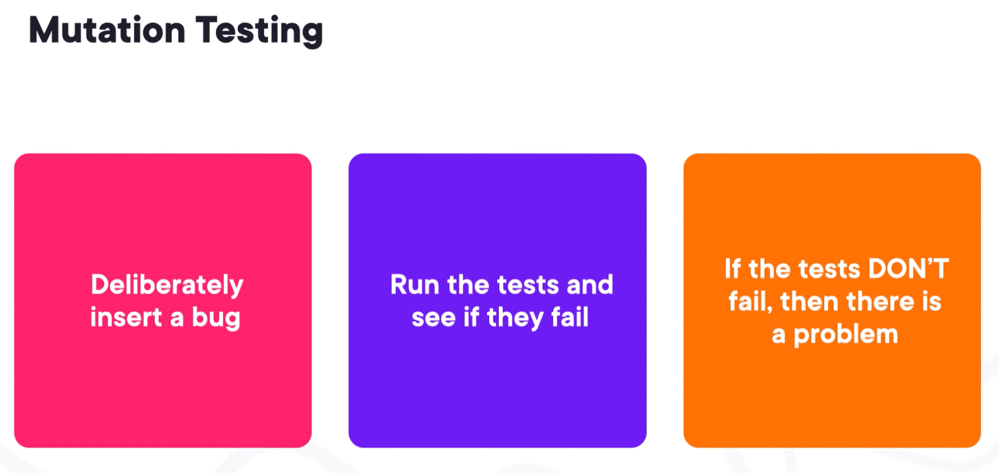

We can make mutation tests by hand, just deliberatly introducing some bugs into our code and test if the mutant 
survives. 

Although, there are planty tools for automate Mutation tests:
- Pytest-Mutagen
- MutPy
- MutMut
- Mutatest
- Cosmic Ray

#### Pairwise Testing 

Now we have killed all the mutants in our code and have 100% coverage in our class 🥳🎉!

But, it comes with a cost. We have a test suite with up to 120 test cases. That´s a lot 😱😱😱!!

Having all mutants of our code properly tested and 100% of coverage comes with a price: it can be too computation intensive 
to run all these tests all the time.

When talking about tests, it's always a trade-off: as more test we have, more coverage we have, but it takes more time 
to run the test suite.

In order to have a good coverage and safety, but not taking too long to run the tests, we need to balance and choose 
the tests cases that are most relevant to our test.

For this we can use `approvaltests.verify_best_covering_pairs` instead of `approvaltests.verify_all_combinations`. This 
function will select some test cases, but keep giving you a good coverage.

```python
def test_update_quality():
    names = ["foo", "Aged Brie", "Backstage passes to a TAFKAL80ETC concert", "Sulfuras, Hand of Ragnaros"]
    sell_ins = [-1, 0, 1, 6, 11]
    qualities = [0, 1, 2, 48, 49, 50]

    approvaltests.verify_best_covering_pairs(
        update_quality_for_item,
        [names, sell_ins, qualities],
        formatter=update_quality_printer
```

It will cut down our test cases from 120 to 30, but keep giving us a 97% coverage. So, we "lost" only 3% of coverage in 
order to have a faster test suite. In this teste, one mutant survived too, but is a very low price to pay for having a 
fast test suite.

**OBS**: Bear in mind that is up to you to decide whether to have faster tests or the very best coverage. Systems that 
must be precise and very reliable like aerospacial, navigation or health, should be more protected and bug free 
than have a test suite that runs faster 😉.

## Testing Code That's Difficult to Test

There are some code that make writing tests very difficult. Some things that make a code hard to test are:
- Poor separation of concerns;
- Lack of encapsulation;
- Poor structures;
- Needs refactoring.

In opposite of that, a code that's easy to test usually have:
- Pure functions, that have a logic without side effects or external dependencies;
- Code we can easily isolate with a test double;

### Peel Strategy

The peel strategy is a helpfull technique to test "mostly logic" parts of the code. It consists in refactoring the
code, isolating a piece of code that easier to test into a functions, a pure function. So we can test it properly.

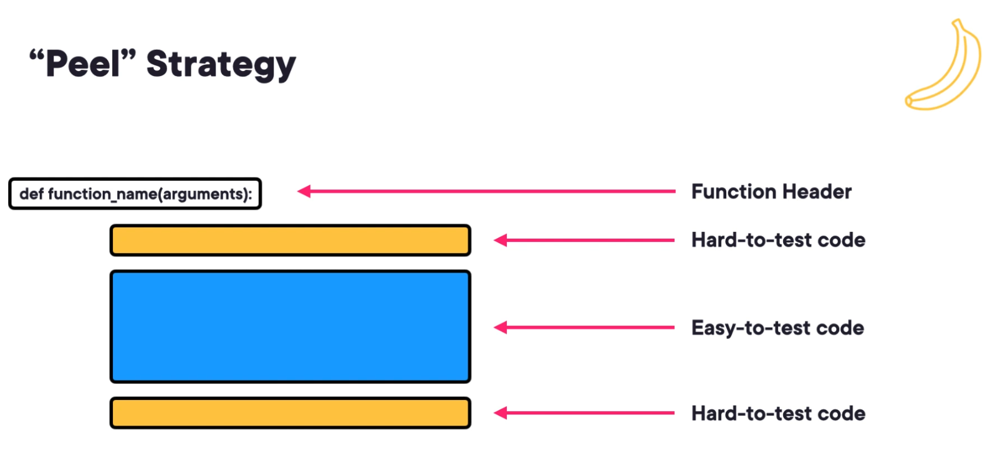
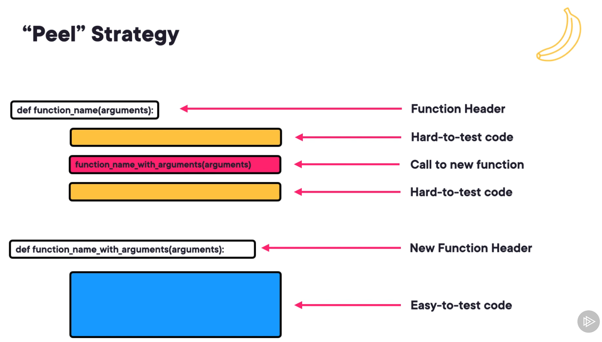

### Slice Strategy

The slice strategy help us when the hard-to-test part of the code is in the middle. In this case we should isolate the
parts that is hard to test first, isolating side effects. Then we refactor the easy parts in order to make it testable.

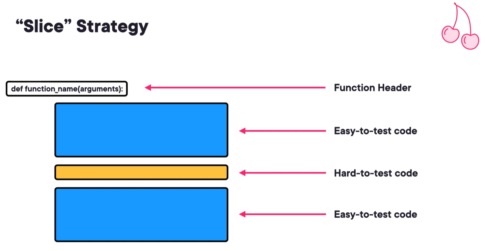
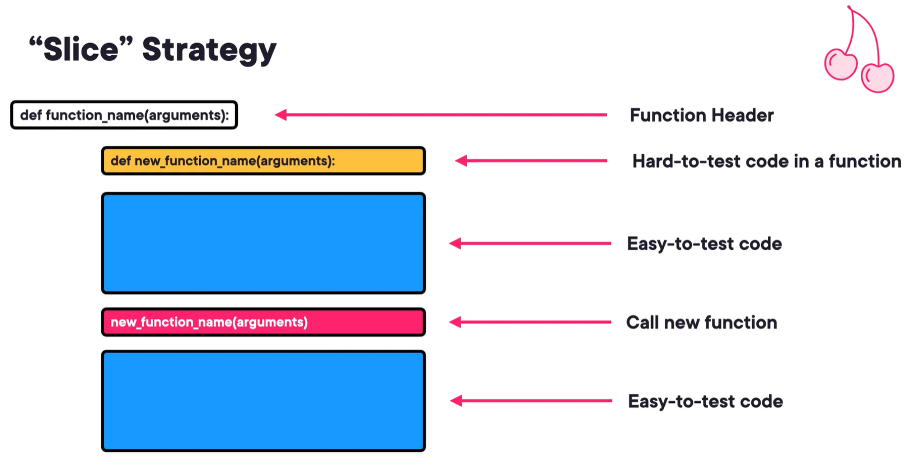

A piece of example code.

```python
import datetime

import scorer
from scorer import IceCream


def print_sales_forecasts():
    names = ["Steve", "Julie", "Francis"]
    now = datetime.datetime.now()
    print(f"Forecast at time {now}")
    for name in names:
        if name == "Steve":
            scorer.flavour = IceCream.Strawberry
        else:
            scorer.update_selection()
        score = scorer.get_sales_forecast()
        print(f"{name} score: {score}")
```

When run the tests, the `scorer.update_selection()` breakes it because it has a randon choices os flavours. It returns 
Vanilla, Chocolate or Strawberry, so we can't predict what it will be used to properly test it. 

Same thing to the code `now = datetime.datetime.now()`. Every time we run the tests, it will get a new date time.

```python
from forecasts import print_sales_forecast


def test_sales_forecasts(capsys):
    print_sales_forecasts()
    output = capsys.readouterr()
    assert output.out == "" 
```

For the `now = datetime.datetime.now()` we cant use the `capsys`, a fixture that allows us to spy on the content of an 
output. When running this test above, it will fail, but will also give us the value of `datetime.datetime.now()`, so we 
can mock this value.

```python
from forecasts import print_sales_forecast


def test_sales_forecasts(capsys):
    print_sales_forecasts(now=datetime.datetimefromisoformat('2025-08-04 05:49:34.145035'))
    output = capsys.readouterr()
    assert output.out == "" 
```

Now we have to refactor the function `print_sales_forecasts` in the main class to receive the current datetime as an
optional parameter. Now the `print_sales_forecasts` doesn't deppend exclusively of the global `datetime.datetime.now()` 
anymore.

```python
import datetime

import scorer
from scorer import IceCream


def print_sales_forecasts(now=None):
    names = ["Steve", "Julie", "Francis"]
    now = now or datetime.datetime.now()
    print(f"Forecast at time {now}")
    for name in names:
        if name == "Steve":
            scorer.flavour = IceCream.Strawberry
        else:
            scorer.update_selection()
        score = scorer.get_sales_forecast()
        print(f"{name} score: {score}")
```

Now, we have to slice the other point of the code that is hard to test: `scorer.update_selection()`. This line is hard 
to test, and it's right in the middle of the logic. The problem here is that this method returns a random flavor, so 
our tests can pass  sometimes and fail others.

The strategy is to isolate this call in a local function `update_selection` so we can use a stub in on our tests.

```python
import datetime

import scorer
from scorer import IceCream


def print_sales_forecasts(now=None):
    def update_selection():
        scorer.update_selection()

    names = ["Steve", "Julie", "Francis"]
    now = now or datetime.datetime.now()
    print(f"Forecast at time {now}")
    for name in names:
        if name == "Steve":
            scorer.flavour = IceCream.Strawberry
        else:
            update_selection()
        score = scorer.get_sales_forecast()
        print(f"{name} score: {score}")
```

This refactoring doesn't solve the problem, but allow us now to use the peel strategy. We can move the rest of the code 
to a new function `print_sales_forecast_and_update_selection`. One of the arguments for this new funtion is a reference 
to the inner function we created earlier `update_selection`. 

That allow us to replace it for a test double in our test suite. 

```python
import datetime

import scorer
from scorer import IceCream


def print_sales_forecasts(now=None):
    def update_selection():
        scorer.update_selection()

    print_sales_forecast_and_update_selection(now, update_selection)


def print_sales_forecast_and_update_selection(now, update_selection):
    names = ["Steve", "Julie", "Francis"]
    now = now or datetime.datetime.now()
    print(f"Forecast at time {now}")
    for name in names:
        if name == "Steve":
            scorer.flavour = IceCream.Strawberry
        else:
            update_selection()
        score = scorer.get_sales_forecast()
        print(f"{name} score: {score}")
```

Test case:

```python
import datetime

import approvaltests

from forecast import print_sales_forecasts, print_sales_forecast_and_update_selection
from scorer import IceCream
import scorer

def stub_update_selection():
    scorer.flavor = IceCream.Vanilla

def test_sales_forecast(capsys):
    print_sales_forecast_and_update_selection(
        now=datetime.datetime.fromisoformat('2025-08-04 05:49:34.145035'),
        update_selection=stub_update_selection)
    output = capsys.readouterr()
    approvaltests.verify(output.out)
```

Now, if we run our tests, it should pass consistently. 

Although the coverage shows us the lack of tests in the `print_sales_forecasts` function, it shouldn't be a problem 
because it has no business rules anymore. All the logic was transfered to `print_sales_forecast_and_update_selection` 
function, and that's were the tests should be focused on.

### Monkeypatching

"Monkeypatching" is another name for metaprogramming. It's when you dinamically change an attribute or a method at 
runtime for something else in order to minimize side effects in our test. It can be a very usefull way to insert a 
test double.

Let's get an exemple:

```python
import enum
import random
import requests


class IceCream(enum.Enum):
    Strawberry = 1
    Chocolate = 2
    Vanilla = 3


flavour = None


def get_score():
    sunny_today = lookup_weather()
    return get_score_with_weather_and_flavour(sunny_today, flavour)


def get_score_with_weather(sunny_today, current_flavour=None):
    if current_flavour == IceCream.Strawberry:
        if sunny_today:
            return 10
        else:
            return 5
    elif current_flavour == IceCream.Chocolate:
        return 6
    elif current_flavour == IceCream.Vanilla:
        if sunny_today:
            return 7
        else:
            return 5
    else:
        return -1


def lookup_weather(location=None):
    location = location or (59.3293, 18.0686)  # default to Stockholm
    days_forward = 0
    params = {"latitude": location[0], "longitude": location[1], "days_forward": days_forward}
    weather_app = "http://127.0.0.1:3005"
    response = requests.get(weather_app + "/forecast", params=params)
    if response.status_code != 200:
        raise RuntimeError("Weather service unavailable")
    forecast = response.json()
    return bool(forecast["weather"]["main"] == "Sunny")

```

Look that we have a request to an API to get the weather in the `lookup_wheather` method. It receives a json and a http 
status code as a response. If our test calls this API when running and this API is not working properly, or return a 
real weather that we're not expecting, it may break the test. So let's monkeypatch it.

```python
import approvaltests
import pytest
import requests

import scorer
from scorer import get_score, IceCream, get_score_with_weather_and_flavour


class StubWeatherServiceResponse:
    def __init__(self):
        self.status_code = 200

    def json(self):
        return {"weather": {"main": "Sunny"}}


def test_lookup_weather_default_location(monkeypatch):
    def stub_requests_get(*args, **kwargs):
        return StubWeatherServiceResponse()

    monkeypatch.setattr(requests, "get", stub_requests_get)
    assert scorer.lookup_weather() == True

```

The function `test_lookup_weather_default_location` receives a `monkeypatch` as a parameter and that will be the stub 
for our request. We create the class `StubWeatherServiceResponse` that will replace the response we receive from real 
service. 

To use the monkeypatch we need to set the atrributes to it (`setattr`), containning the object we want to stub 
(`requests`), the method we want to replace ("get") and what we want ir to return (`stub_requests_get` that is the 
object that will mock our response).

Inside the context of our test, when `scorer.lookup_weather()` calls the `request.get` it will be replaced by our 
monkeypatch that will replace the real request and return our fake object.

#### Pitfalls with Monkeypatching

Although very usefull, monkeypatching cam make our tests hard to read and understand, making you ended up not testing 
what you think you are testing.

Test doubles get out of sync with the real object quite easily, and you can find your test is passing but the real 
object has a changed behaviour that your mock doesn't. In this case, your test double can hide this problem from you.
Be aware.

Also, test doubles can hinder refactoring. Renamming a method may cause our test to break, but can be worse if you 
create new objects and move methods around.

### Self-Initialize Fake

It's another monkeypatch fake, but instead of write it by hand, like the exemple before, you just record it from the 
real API once and then use these recorded response as deouble.

In order to use it, we need to install 2 new dependencies on our tests:

```
vcrpy
pytest-recording
```

After install it, we need to add a new parameter to python execution:
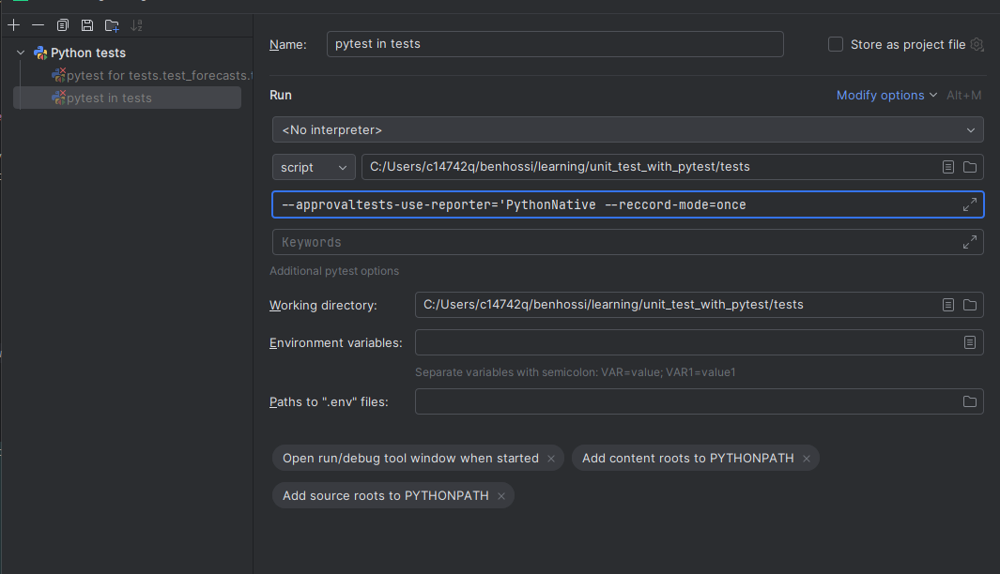

The mode `once` will record any new interaction the first time and then use the recorded results, the cassettes to 
replay them.

It will create a yaml file with te same name of our test case, with all the response from the API we're mocking.
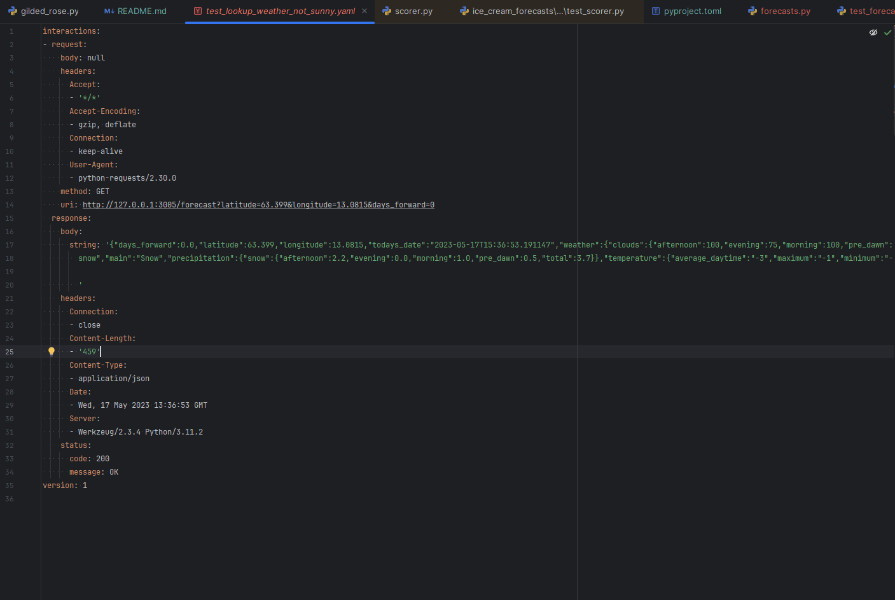

Now, let's go to the code:

```python
import approvaltests
import pytest
import requests

import scorer
from scorer import get_score, IceCream, get_score_with_weather_and_flavour

@pytest_mark_vcr
def test_lookup_weather_not_sunny():
    location_aare = (63.3990, 13.0815)
    assert scorer.lookup_weather(location_aare) == False
```

Now, with vcr, we just assert it from the original scorer object, and it will use the yaml file as a response.

If in the future the server changes the response, we can just delete the cassete and run it again to get a new one.

#### Pitfalls with Self-Initialize Fake

It's still using a monkeypatch underneat, but the api is very stable. This approach makes the test more readable, 
strait forward and simple to undertand.

Your cassets files might get out of date compared with the real server. That's the big danger, altough it is realtively 
easy to rerecord it again. If you have access to the API, from time to time, delete the cassetes and generate it again.

As all test double, it can hinder refactoring. However, sefl-initialize test using vcr, make refactoring much easier.
