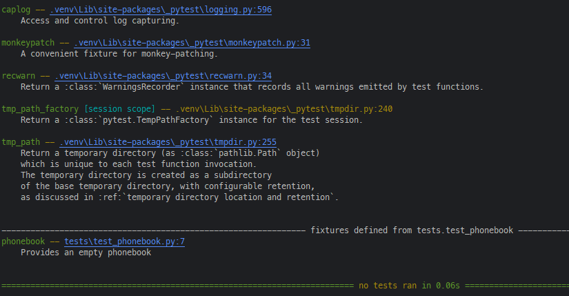

from phonebook import Phonebook

# Unit Tests With PYTEST

Course: Testing in Python 3 by Emily Bache on Pluralsight

## Installation
- pip
  - Run in terminal: `python -m pip install pytest`
- uv
  - Run in terminal : `uv add pytest --dev`
    - it will add `pytest` as a developmente dependency to your `pyproject.toml`.

## Test Vocabulary

- Test Suite
  - It's all the tests you have implemented and could run to assure everything is ok.
- Test case
  - It's a single teste you write to validade a cenário.
- Fixture
  - Code to manage resourses that you'll need during your tests
- Runner
  - The result report of your tests.
- Units Under Test
  - the class/method/ function that you

## Pytest Structure

Create a python package named `tests` on your project and mark it as `Test Source Root` on Pycharm.

Inside it, create a file starting with `test_` or finishing with `_test.py`, and add your tests inside it.
E.G:

```python
import pytest

from module03 import Phonebook


def test_lookup_by_name(phonebook):
  phonebook = Phonebook()
  phonebook.add("Bob", "12345")
  number = phonebook.lookup("Bob")
  assert number == "12345"
```

### Testing Exceptions

In order to test a method that throws an exception, you should create a context manager to capture the exception. 
It is done with the `pytest.riases(Exception)`.

```python
import pytest

from module03 import Phonebook


def test_missing_name(phonebook):
  phonebook.add("Bob", "12345")
  with pytest.raises(KeyError):
    phonebook.lookup("Mary")


```

### Pytest Fixture

Pytest use the decorator `@pytest.fixture` to create its fixtures (setup and teardowm). By convention, the def name of the fixture is the resource you're returning/instanciate nad you shoul pass it as aparameter on your teste cases.

#### Setup Fixture

The decorator `@pytest.fixture` is runned first, creating the object that will be used for the test case `test_find_character`.

```python
import pytest

from module03 import Phonebook


@pytest.fixture
def phonebook():
  '''Provides an empty phonebook.'''
  phonebook = Phonebook()
  return phonebook


def test_lookup_by_name(phonebook):
  phonebook.add("Bob", "12345")
  number = phonebook.lookup("Bob")
  assert number == "12345"

```

#### Setup and Teardown Fixture

It uses the same structure, but instead of returning the object with a `return`, use `yield` to wait until the resource is released.
In the exemple bellow, the class Phonebook receive a file as an argument on `__init__` that should be destroyed after the test case finishes.

```python
import pytest

from src.module03.phonenumbers import Phonebook


@pytest.fixture
def phonebook(tmpdir):
  '''Provides an empty phonebook.'''
  phonebook = Phonebook(tmpdir)
  yield phonebook
  phonebook.clear_cache()


def test_missing_name(phonebook):
  phonebook.add("Bob", "12345")
  with pytest.raises(KeyError):
    phonebook.lookup("Mary")
```

**OBS**: the `tmpdir` passed as a parameter to Phonebook, is a builtin fixture of pytest that provides a temporary and unique directory to each test case.

To see all the fixture of a test suite, run one of the commands bellow on the terminal. If your test fixture has a docstring. it will be shown here.
```pytest --fixtures```
```python -m pytest --fixtures```



**OBS**: to show all the fixtures you have in your test cases, you should th PYTHONPATH on your terminal
```shell
PYTHONPATH='<your_source_code_dir>'
```
```shell
$env:PYTHONPATH='src'
```

### Parametrized Test

We can use parametrized tests when we need to test method with diferents inputs. So, intead of write different tests or 
make a lot of asserts inside a single test case, we can just make a lot of diferent entries to a single test case.

```python
import pytest

from src.module03.phonenumbers import Phonebook


@pytest.fixture
def phonebook(tmpdir):
  '''Provides an empty phonebook.'''
  phonebook = Phonebook(tmpdir)
  yield phonebook
  phonebook.clear_cache()


@pytest.mark.parametrize(
  "entry1, entry2, is_consistent", [
    (("Bob", "12345"), ("Anna", "012345"), True),
    (("Bob", "12345"), ("Anna", "12345"), False),
    (("Bob", "12345"), ("Anna", "123"), False),
  ]
)
def test_is_consistent(phonebook, entry1, entry2, is_consistent):
  phonebook.add(*entry1)
  phonebook.add(*entry2)
  assert phonebook.is_consistent() == is_consistent
```

Paramitrized testing helps to reduce duplication in the code and it's recommended when the test case (the 'act' step) 
is the same in the others test cases and we just need to vary the data we use to test.

### Organizing Your Test Code

When we deal with large projects, is common to use some special features:

#### conftest.py

It is a special modile/file that pytest recognizes, and it's the recommended module to store all your fixtrues.
All test cases inside the test module will look for fixtures inside the `confitest.py`.

#### Pytest Marks

Pytest Marks allows you to add metadata or labels to your test cases, making it easier to organize and customise your test cases.

To see all pytest markers, hjust type `python -m pytest --markers` in the terminal.

##### The `pytest.ini`

A file to store all the personal configuration to your pytest

```text
[pytest]
addopts = --strict-markers
markers = slow: Run tests that use sample data from file (deslect with '-m "not slow"')
```

The `addopts = --strict-markers` avoid users to use markers that is not listed on the markers parameter in the ini file.

##### @pytest.mark.slow

It's a pytest decorator to sinalize that the test case may be slow and can be skipped if you want.
We can use a `pytest.ini` file to configure how to run it or not.

E.G: 
This test loads a csv file that can have tons of data, and take too much time to run.

```python
import csv
import pytest
from src.module03.phonenumbers import Phonebook


@pytest.fixture
def phonebook(tmpdir):
  '''Provides an empty phonebook.'''
  phonebook = Phonebook(tmpdir)
  yield phonebook
  phonebook.clear_cache()


@pytest.mark.slow
def test_large_file(phonebook):
  with open("sample_data/sample1.csv") as f:
    csv_reader = csv.DictReader(f)
    for row in csv_reader:
      name = row["Name"]
      number = row["Number"]
      phonebook.add(name, number)
  assert phonebook.is_consistent()

```

Now, this test can be "skipped" when you run all the test suite, just typying `python -m pytest -m "not slow"` in the terminal.
That will deselect the test cases marked with `@pytest.mark.slow` decorator, and it will not run.

This is very helpful in test cases that tak too long to run in development environment. Just run the fast ones or run all just when you need.

##### @pytest.mark.skip

It is usefull when your test case is not ready yet, or the feature it tests is not already finished, and you don't want 
run it.

```python
import pytest

@pytest.mark.skip("Not already implemented.")
def test_new_feature():
  assert True
```

Unlike the `@pytest.mark.slow`, the `@pytest.mark.skip` can not be run. Once it's marked as a skipp test case, it will 
only run when you remove the decorator.

##### @pytest.mark.skipif

Similar to the `@pytest.mark.skip` but with a conditional.

```python
import pytest
import sys
from src.module03.phonenumbers import Phonebook


@pytest.mark.skipif(sys.version_info < (3, 6), reason="requires python 3.6 or higher to run")
def test_phonebook_contain_names():
  phonebook = Phonebook()
  assert 'Bob' in phonebook.names()
```

If you're running python 3.6, this test will be skipped.
~~~~
