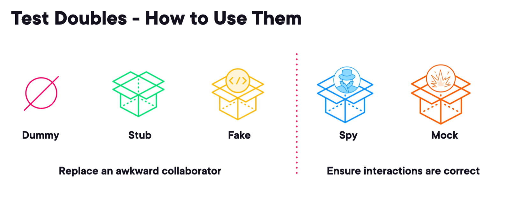

from phonebook import Phonebook

# Unit Tests With PYTEST

Course: Testing in Python 3 by Emily Bache on Pluralsight

## Installation
- pip
  - Run in terminal: `python -m pip install pytest`
- uv
  - Run in terminal : `uv add pytest --dev`
    - it will add `pytest` as a developmente dependency to your `pyproject.toml`.

## Test Vocabulary

- Test Suite
  - It's all the tests you have implemented and could run to assure everything is ok.
- Test case
  - It's a single teste you write to validade a cenário.
- Fixture
  - Code to manage resourses that you'll need during your tests
- Runner
  - The result report of your tests.
- Units Under Test
  - the class/method/ function that you
- Assertions
  - Assertions are the validations that are executed in the middle or end of the test cases to evaluate that the actual result is as expected.
  - There are 3 types of assert:
      - 

## Pytest Structure

Create a python package named `tests` on your project and mark it as `Test Source Root` on Pycharm.

Inside it, create a file starting with `test_` or finishing with `_test.py`, and add your tests inside it.
E.G:

```python
import pytest

from module03 import Phonebook


def test_lookup_by_name(phonebook):
  phonebook = Phonebook()
  phonebook.add("Bob", "12345")
  number = phonebook.lookup("Bob")
  assert number == "12345"
```

### Testing Exceptions

In order to test a method that throws an exception, you should create a context manager to capture the exception. 
It is done with the `pytest.riases(Exception)`.

```python
import pytest

from module03 import Phonebook


def test_missing_name(phonebook):
  phonebook.add("Bob", "12345")
  with pytest.raises(KeyError):
    phonebook.lookup("Mary")


```

### Pytest Fixture

Pytest use the decorator `@pytest.fixture` to create its fixtures (setup and teardowm). By convention, the def name of the fixture is the resource you're returning/instantiate. 
and you should pass it as a parameter on your teste cases.

#### Setup Fixture

The decorator `@pytest.fixture` is runned first, creating the object that will be used for the test case `test_find_character`.

```python
import pytest

from src.module03.phonenumbers import Phonebook


@pytest.fixture
def phonebook():
  '''Provides an empty phonebook.'''
  phonebook = Phonebook()
  return phonebook


def test_lookup_by_name(phonebook):
  phonebook.add("Bob", "12345")
  number = phonebook.lookup("Bob")
  assert number == "12345"

```

#### Setup and Teardown Fixture

It uses the same structure, but instead of returning the object with a `return`, use `yield` to wait until the resource is released.
In the exemple bellow, the class Phonebook receive a file as an argument on `__init__` that should be destroyed after the test case finishes.

```python
import pytest

from src.module03.phonenumbers import Phonebook


@pytest.fixture
def phonebook(tmpdir):
  '''Provides an empty phonebook.'''
  phonebook = Phonebook(tmpdir)
  yield phonebook
  phonebook.clear_cache()


def test_missing_name(phonebook):
  phonebook.add("Bob", "12345")
  with pytest.raises(KeyError):
    phonebook.lookup("Mary")
```

**OBS**: the `tmpdir` passed as a parameter to Phonebook, is a builtin fixture of pytest that provides a temporary and unique directory to each test case.

To see all the fixture of a test suite, run one of the commands bellow on the terminal. If your test fixture has a docstring. it will be shown here.
```pytest --fixtures```
```python -m pytest --fixtures```


**OBS**: to show all the fixtures you have in your test cases, you should th PYTHONPATH on your terminal
```shell
PYTHONPATH='<your_source_code_dir>'
```
```shell
$env:PYTHONPATH='src'
```

### Parametrized Test

We can use parametrized tests when we need to test method with diferents inputs. So, intead of write different tests or 
make a lot of asserts inside a single test case, we can just make a lot of diferent entries to a single test case.

```python
import pytest

from src.module03.phonenumbers import Phonebook


@pytest.fixture
def phonebook(tmpdir):
  '''Provides an empty phonebook.'''
  phonebook = Phonebook(tmpdir)
  yield phonebook
  phonebook.clear_cache()


@pytest.mark.parametrize(
  "entry1, entry2, is_consistent", [
    (("Bob", "12345"), ("Anna", "012345"), True),
    (("Bob", "12345"), ("Anna", "12345"), False),
    (("Bob", "12345"), ("Anna", "123"), False),
  ]
)
def test_is_consistent(phonebook, entry1, entry2, is_consistent):
  phonebook.add(*entry1)
  phonebook.add(*entry2)
  assert phonebook.is_consistent() == is_consistent
```

Paramitrized testing helps to reduce duplication in the code and it's recommended when the test case (the 'act' step) 
is the same in the others test cases and we just need to vary the data we use to test.

### Organizing Your Test Code

When we deal with large projects, is common to use some special features:

#### conftest.py

It is a special modile/file that pytest recognizes, and it's the recommended module to store all your fixtrues.
All test cases inside the test module will look for fixtures inside the `confitest.py`.

#### Pytest Marks

Pytest Marks allows you to add metadata or labels to your test cases, making it easier to organize and customise your test cases.

To see all pytest markers, hjust type `python -m pytest --markers` in the terminal.

##### The `pytest.ini`

A file to store all the personal configuration to your pytest

```text
[pytest]
addopts = --strict-markers
markers = slow: Run tests that use sample data from file (deslect with '-m "not slow"')
```

The `addopts = --strict-markers` avoid users to use markers that is not listed on the markers parameter in the ini file.

##### @pytest.mark.slow

It's a pytest decorator to sinalize that the test case may be slow and can be skipped if you want.
We can use a `pytest.ini` file to configure how to run it or not.

E.G: 
This test loads a csv file that can have tons of data, and take too much time to run.

```python
import csv
import pytest
from src.module03.phonenumbers import Phonebook


@pytest.fixture
def phonebook(tmpdir):
  '''Provides an empty phonebook.'''
  phonebook = Phonebook(tmpdir)
  yield phonebook
  phonebook.clear_cache()


@pytest.mark.slow
def test_large_file(phonebook):
  with open("sample_data/sample1.csv") as f:
    csv_reader = csv.DictReader(f)
    for row in csv_reader:
      name = row["Name"]
      number = row["Number"]
      phonebook.add(name, number)
  assert phonebook.is_consistent()

```

Now, this test can be "skipped" when you run all the test suite, just typying `python -m pytest -m "not slow"` in the terminal.
That will deselect the test cases marked with `@pytest.mark.slow` decorator, and it will not run.

This is very helpful in test cases that tak too long to run in development environment. Just run the fast ones or run all just when you need.

##### @pytest.mark.skip

It is usefull when your test case is not ready yet, or the feature it tests is not already finished, and you don't want 
run it.

```python
import pytest

@pytest.mark.skip("Not already implemented.")
def test_new_feature():
  assert True
```

Unlike the `@pytest.mark.slow`, the `@pytest.mark.skip` can not be run. Once it's marked as a skipp test case, it will 
only run when you remove the decorator.

##### @pytest.mark.skipif

Similar to the `@pytest.mark.skip` but with a conditional.

```python
import pytest
import sys
from src.module03.phonenumbers import Phonebook


@pytest.mark.skipif(sys.version_info < (3, 6), reason="requires python 3.6 or higher to run")
def test_phonebook_contain_names():
  phonebook = Phonebook()
  assert 'Bob' in phonebook.names()
```

If you're running python 3.6, this test will be skipped.

## Test Doubles

A Test Double is recommended when you want to test a code unit that has a dependency, like an object or an external tool.

So you can replace that code for a Test Doble that does and return what you need without more complexity.

It may look not productive to "re-write" a code, but, sometimes, the class/object you need is too complex to instantiate
or your code use an external API that may be caught off-line during your test. You can't take this risk, so you should 
use a Test Double to ensure that your test case has all data and tools it need inside it. In the most cases you just 
need what the API or an object returns. That's why Test Doubles are made for.


### Stubs

Stubs allows you to set a hard coded response (or return) for a method of an object.

For exemple:
```python
from src.module05.stub.alarm import Alarm


class StubSensor:
    def sample_pressure(self):
        return 17.0


def test_alarm_is_on_at_lower_threshold():
    alarm = Alarm(StubSensor())
    alarm.check()
    assert alarm.is_alarm_on
```

In the exemple above, we created a stub of the calss Sensor (StubSensor) that Alarm needs to be constructed. For our test, doesn't 
matter what the `sample_pressure` method does, as we get a value 17.0 from it. So we hard coded te value we need as the 
return of the method `sample_pressure`.

Another exemple using Mock:
```python
from unittest.mock import Mock

from src.module05.stub.alarm import Alarm
from src.module05.stub.sensor import Sensor


def test_alarm_is_on_at_lower_threshold():
    stub = Mock(Sensor)
    stub.sample_pressure.return_value = 17.0
    alarm = Alarm(stub)
    alarm.check()
    assert alarm.is_alarm_on

```
Now we're using the python built-in `Mock` to build the stub. It does the same as the previous exemple, but more 
concisely. When you use Mock a pass the real class you want stub, Mock has access to all methods of the real class and 
can replace what is returned as we see in the code `stub.sample_pressure.return_value = 17.0`.

### Fakes

Fake is like a stub but has an implementation with logic, behavior, but is not good for production.
They're a good option when you're dealing with a files. That can be slow, so you can fake the file in memory to run 
your tests.


E.g.:
```python
import io

from src.module05.fake.html_pages import HtmlPagesConverter


def test_convert_second_page():
    fake_file = io.StringIO("""\
page one
PAGE_BREAK
page two
PAGE_BREAK
page three
PAGE_BREAK
    """)
    converter = HtmlPagesConverter(fake_file)
    converted_text = converter.get_html_page(1)
    assert converted_text == "page two<br />"
```
In the exemple above, the library `io.StringIO` is replacing the real file. It has the same methods a file has but it
runs entirely on memory, which eliminates the external dependencies.

### Dummy Objects
Provides an alternative actor in place of a real object (sometimes None) in order to test our cenario.

E.g.:

````python
import pytest


def fizzbuzz(n, additional_rules):
    answer = str()
    rules = {3: "Fizz", 5:"Buzz"}
    additional_rule = {7: "Whizz"}
    if additional_rules:
        rules.update(additional_rule)

    for divisor in sorted(rules.keys()):
        if n % divisor == 0:
            answer += rules[divisor]

    if not answer:
        answer = str(n)

    return answer


@pytest.mark.parametrize(
    "number, expected", [
        (2, "2"),
        (3, "Fizz"),
        (5, "Buzz"),
        (15, "FizzBuzz"),
    ]
)
def test_fizzbuzz_nomal_number(number, expected):
    assert fizzbuzz(number) == expected


@pytest.mark.parametrize(
    "number, additional_rules, expected", [
        (7, {7: "Whizz"}, "Whizz"),
    ]
)
def test_fizzbuzz_nomal_number(number, additional_rules, expected):
    assert fizzbuzz(number, additional_rules) == expected

````
In this teste case, the `test_fizzbuzz_nomal_number` will pass, but the `test_fizzbuzz_nomal_number` will break because 
it doesn't passes the new argument `additional_rules` to the function `fizzbuzz`. 

So, as this test case doesn't test the additional rules at all, we can just pass `None` as an argument.

```python
@pytest.mark.parametrize(
    "number, expected", [
        (2, "2"),
        (3, "Fizz"),
        (5, "Buzz"),
        (15, "FizzBuzz"),
    ]
)
def test_fizzbuzz_nomal_number(number, expected):
    assert fizzbuzz(number, None) == expected
```

Using a dummy on your tests usually can be a design smell on your code. In this case, the argument `additional_rules` 
should be an optional paameter in the function.

E.g.:
```python
import pytest


def fizzbuzz(n, additional_rules=None):
    answer = str()
    rules = {3: "Fizz", 5:"Buzz"}
    additional_rule = {7: "Whizz"}
    if additional_rules:
        rules.update(additional_rule)

    for divisor in sorted(rules.keys()):
        if n % divisor == 0:
            answer += rules[divisor]

    if not answer:
        answer = str(n)

    return answer


@pytest.mark.parametrize(
    "number, expected", [
        (2, "2"),
        (3, "Fizz"),
        (5, "Buzz"),
        (15, "FizzBuzz"),
    ]
)
def test_fizzbuzz_nomal_number(number, expected):
    assert fizzbuzz(number) == expected


@pytest.mark.parametrize(
    "number, additional_rules, expected", [
        (7, {7: "Whizz"}, "Whizz"),
    ]
)
def test_fizzbuzz_nomal_number(number, additional_rules, expected):
    assert fizzbuzz(number, additional_rules) == expected
```
In the exemple above, we no longer need the dummy because we fiz our design smell just defining a default value to the 
`additional_rules`.

You can use a dummy when you're forced to pass a collaborator to a class or method that is not used in the scenario 
you're testing.

### Spy

A Spy records the method calls it receives, so we can assert they are correct.

E.g.:
```python
from unittest.mock import Mock, call

from src.module05.spy.discounts import DiscountManager
from src.module05.spy.model_objects import Product, User, DiscountData

def test_for_for_users_with_mock_framework():
    notifier = Mock()
    discount_manager = DiscountManager(notifier)
    product = Product("headphones")
    product.discounts = list()
    discount_details = DiscountData("10% off")
    users = [User("user1", [product]), User("user2", [product])]

    discount_manager.create_discount(product, discount_details, users)

    assert product.discounts == [discount_details]
    expected_calls = [
        call(users[0], f"You may be interested in a discount on this product! {product.name}"),
        call(users[1], f"You may be interested in a discount on this product! {product.name}"),
    ]
    notifier.notify.assert_has_calls(expected_calls)
```

The exemple above uses the Mock framework from python Unittest to build a spy. This object has a method named 
`assert_has_calls` that receive a call object in rder to check if they are called.

In this case, the Notifier object has a `notify` method that receives the user and the message, so we create a list of 
those call (in the `expected_calls` list) to use it in the `assert_has_calls`.

### Mock

A Mock knows what method calls to expect, and fails the test if they ar not correct.
It works like a spy but Mocks is told in advance about what method will be called.

E.g.:
```python
from src.module05.spy.discounts import DiscountManager
from src.module05.spy.model_objects import Product, DiscountData, User


class MockNotifier:
    def __init__(self):
        self.expected_user_notification = list()

    def notify(self, user, message):
        # Don't send any messages from the unit test, check all notifications are expected
        expected_user = self.expected_user_notification.pop(0)
        if user != expected_user:
            raise RuntimeError(f"Got notification message for unexpected user {user.name}. Was expecting notification "
                               f"for user {expected_user.name}")

    def expect_notification_to(self, user):
        self.expected_user_notification.append(user)


def test_discount_for_users():
    notifier = MockNotifier()
    discount_manager = DiscountManager(notifier)
    product = Product("headphones")
    product.discounts = list()
    discount_details = DiscountData("10% off")
    users = [User("user1", [product]), User("user2", [product])]
    notifier.expect_notification_to(users[0])
    notifier.expect_notification_to(users[1])

    discount_manager.create_discount(product, discount_details, users)

    assert product.discounts == [discount_details]
```

In the exemple above, the `notifier` has the method `expect_notification_to` that receives the users will be notified.

When the `create_discount` is called, it will call the `notifier.notify` that validates if the user is the correct one.

Using Mock, you told it in advancce what method will be called with what arguments. If these expectatiosn aren't met, 
it throws away an exception in the act part of the test, not in the assertion.

Using a Spy, raises an error afterm in the assertion part of the test.

### How to use Test Doubles



Sumarizing, test doubles are:

- Dummy
  - Usually `None`
- Stub
  - Responds with fixed, pre-prepared data
- Fake
  - Has an implementation, but unsuitable for production
- Spy
  - Similar to Stub, bit can asssert if the test fails. 
- Mock
  - Similar to Spy but throws away an exception in the act part of the test, not in the assertion.
